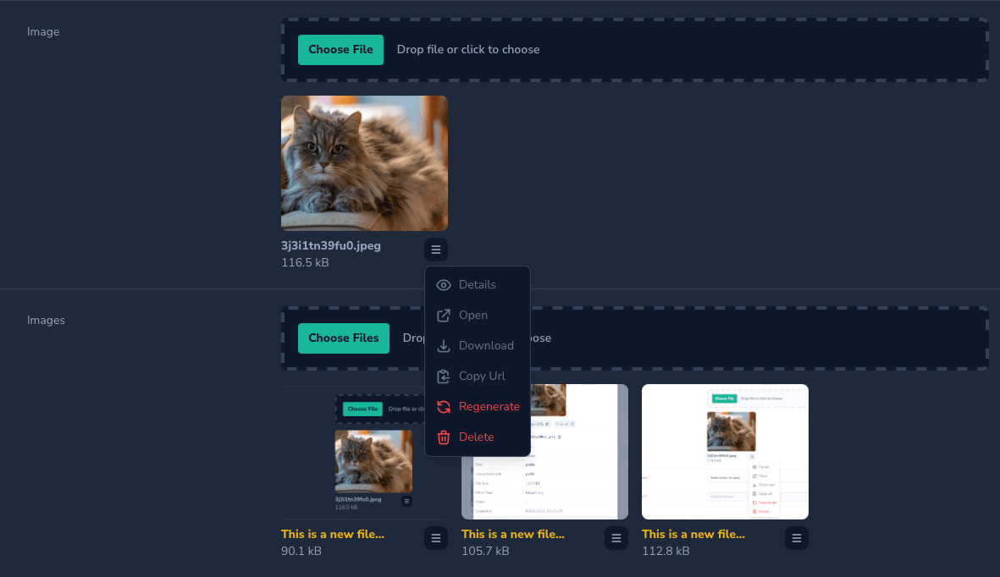
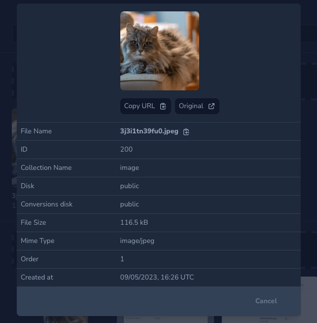
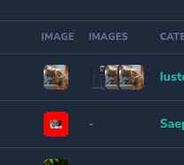
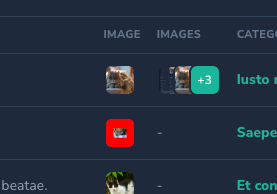
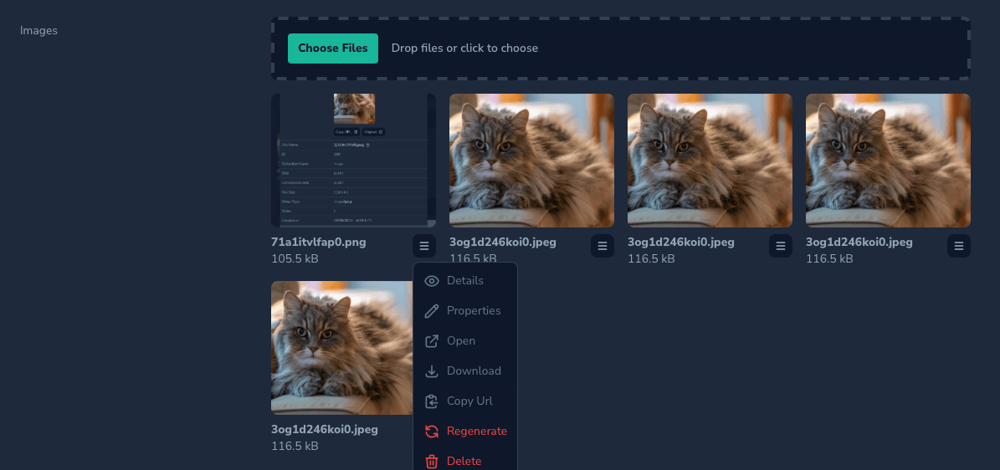
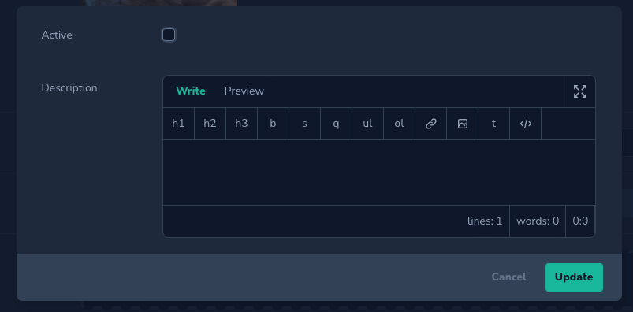

# Nova Media Field

[](https://packagist.org/packages/stepanenko3/nova-media-field)
[](https://packagist.org/packages/stepanenko3/nova-media-field)
[](https://packagist.org/packages/stepanenko3/nova-media-field)


## Description

A Laravel Nova field for laravel-medilibrary.

## Features

- Multiple / Single image support
- Multiple images auto-detect based on collection
- Display validation errors
- Show on index multiple images
- Modal with media details
- Show all conversions
- Open / Download / Copy URL of media
- Regenerate image with conversions
- Custom properties support

## Requirements

- `php: >=8.0`
- `laravel/nova: ^4.0`
- `spatie/laravel-medilibrary`: ^11.4

## Installation

```bash
# Install the package
composer require stepanenko3/nova-media-field
```

## Usage

```php
use use Stepanenko3\NovaMediaField\Fields\Media;
...

Media::make(__('Image'), 'image'), // Single image. Auto detect from collection

Media::make(__('Images'), 'images'), // Multiple images. Auto detect from collection

// Validation rules

Media::make('Images', 'images')
    ->rules(['required', 'array', 'max:4'])
    ->singleMediaRules(['image', 'max:80']),


// Custom properties with validtion

Media::make('Images', 'images')
    ->customPropertiesFields([
        Boolean::make('Active', 'active')
            ->rules(['boolean']),

        Markdown::make('Description', 'description')
            ->rules(['max:1000']),
    ])


// Count images displayed on index

Media::make('Images', 'images')
    ->countOfImagesDisplayedOnIndex(2),


// Full example

Media::make('Images', 'images')
    ->customPropertiesFields([
        Boolean::make('Active', 'active')
            ->rules(['boolean']),

        Markdown::make('Description', 'description')
            ->rules(['max:1000']),
    ])
    ->countOfImagesDisplayedOnIndex(2)
    ->rules(['required', 'array', 'max:4'])
    ->singleMediaRules(['image', 'max:80']),
```

## Usage with File Manager

### Install stepanenko3/nova-filemanager

```bash
compore require stepanenko3/nova-filemanager
```

### Register Service provider

```php
// app/Providers/NovaServiceProvider.php

public function tools(): array
{
    return [
        new Stepanenko3\NovaFileManager\FileManagerTool,
    ];
}
```

### Use Media field with File Manager

```php
Media::make(__('Image'), 'image')
    ->fileManager(),
```

## Screenshots








## Credits

- [Artem Stepanenko](https://github.com/stepanenko3)

## Contributing

Thank you for considering contributing to this package! Please create a pull request with your contributions with detailed explanation of the changes you are proposing.

## License

This package is open-sourced software licensed under the [MIT license](LICENSE.md).
